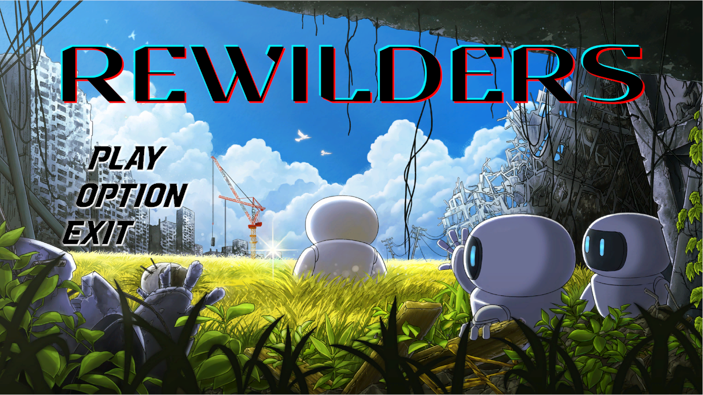

# 게임 소개

이 게임은 최대 3인의 플레이어가 이동수단을 타고 이동하고, 전투와 탐험을 통해 성장하여 최종적으로 강력한 적과 싸워 승리하는 것을 목적으로 하는 RPG(Role Playing Game)입니다. 게임에서는 환경오염과 기상 이변을 형상화한 적들이 등장하며 이들과의 전투를 통해 플레이어가 환경오염에 대한 경각심을 가질수 있도록 만드는 것이 이 게임의 개발 목적입니다. 

## 운영 환경
Windows 10

## 설치방법
Release나 아래 링크를 통해 REWILDERS.zip파일을 다운 받고 압축을 풉니다.

[다운로드](https://github.com/GoeGaebal/Project_G/releases/download/v0.1.0/REWILDERS.zip)

## 실행 방법
실행파일 폴더 내부의 REWILDERS.exe 파일을 실행합니다.
게임 내부에서는 Play 버튼을 누르고 방을 생성하면 플레이가 가능합니다.

본 게임은 싱글플레이와 멀티플레이가 모두 가능합니다.
만약 멀티 플레이를 원한다면 포트포워딩을 먼저 진행한 후, 개방된 포트번호로 대기실을 생성한 다음, 같이 플레이하려는 플레이어에게 외부 IP와 포트번호를 알려주어야 합니다.
해당 플레이어는 Play 버튼을 누른 후 대기실 찾기 창에서, 전달받은 외부 IP와 포트번호를 입력하여 다른 플레이어가 생성한 대기실에 접속할 수 있습니다.

## 조작법

1. 키보드의 wasd 혹은 방향키를 이용해 이동할 수 있습니다.
2. 마우스 왼쪽 버튼을 클릭해 공격할 수 있습니다.
3. 키보드의 ESC 버튼을 클릭해 옵션을 열고 닫을 수 있습니다.
4. 키보드의 I 버튼을 클릭해 인벤토리를 열고 닫을 수 있습니다.
5. 비행선의 창고, 타륜, 제작소, 유물의 근처에서 키보드의 E 버튼을 클릭해 상호작용할 수 있습니다.
6. 필드에서 키보드의 M 버튼을 클릭해 미니맵을 끄고 켤 수 있습니다.

## 게임 플레이 목표
플레이어는 비행선을 타고 다양한 지역을 다닐 수 있습니다.
플레이어는 다양한 지역을 돌아다니며 자원을 채집하고 몬스터와 싸우며 아이템과 유물을 얻습니다.
플레이어는 얻은 아이템을 통해 플레이어 자신과 비행선을 강화합니다.
항상 플레이어를 쫓아오는 최종보스를 피해 달아나야 합니다.
최종보스에게 붙잡히기 전까지 플레이어는 최대한 장비를 강화시켜야 하며, 붙잡힌 후에는 최종보스와의 전투에서 승리해야 합니다.

## 게임 요소 설명
1. 대기실 :
본격적인 게임 시작 전 조작법을 숙지하고 멀티플레이를 위해 다른 플레이어를 기다릴 수 있는 장소입니다.
2. 포탈 :
씬과 씬 사이를 이동하는 장치입니다. 게임에 참여한 모든 플레이어가 포탈에 올라가 있어야 이동이 가능합니다.
3. 로딩 :
씬과 씬 사이를 이동할 시, 로딩 중에 나오며 다양한 정보를 알려줍니다.
4. 비행선 :
플레이어가 전투를 통해 획득한 자원을 사용해 각종 아이템을 제작하고, 다음 전투를 준비하는 장소입니다.
5. 인벤토리 :
여러 아이템을 보관할 수 있습니다.
6. 장비창 :
무기와 포션, 강화 모듈을 장착할 수 있습니다. 플레이어는 다양한 장비를 장착해 플레이어 자신을 강화할 수 있습니다.
7. 창고 :
필드에 가기 전, 비행선의 창고에 아이템을 저장해둘 수 있습니다.
8. 유물 :
다양한 효과를 가져 플레이어와 비행선을 강화할 수 있습니다. 보스 몬스터를 처치하면 얻을 수 있으며 한 번에 3개까지 장착 가능합니다.
9. 채팅창 :
플레이어들 간에 소통할 수 있는 창으로, 엔터키나 클릭으로 입력창을 활성화하여 메시지를 입력합니다. 엔터키를 누르면 메시지가 전송되어 다른 플레이어와 대화할 수 있습니다.
10. 식물 :
비행선에는 식물이 존재하며, 남은 잎의 비율에 따라서 비행선으로 복귀할 때 체력을 회복합니다. 플레이어가 필드 전투에서 패배하면 이파리가 한 장씩 줄어듭니다. 잎이 모두 사라지면 게임이 끝납니다.
11. 타륜 :
월드맵을 표시합니다. 월드맵에서는 비행선의 현재 위치를 확인할 수 있으며 도착지를 설정할 수 있습니다.
12. 타이머 :
게임 내 시간을 표시합니다. 낮과 밤을 알 수 있습니다.
13. 알림창 :
게임의 현재 상황을 플레이어에게 표시합니다. 비행선의 출발 및 도착 정보나 최종보스와의 접근 등의 중요한 정보를 표시하여 플레이어가 상황을 파악할 수 있습니다.
14. 필드 :
환경오염이 진행된 곳으로, 비행선이 특정 장소에 도착하면 열리는 포탈을 통해 진입합니다. 필드에는 재료아이템을 얻을 수 있는 자원들이 있지만, 동시에 플레이어를 위협하는 몬스터들도 서식하고 있습니다.
15. 미니맵 :
필드 내 정보를 간소화하여 보여줍니다. 플레이어는 초록색, 적은 빨간색, 자원은 노란색 박스로 표현됩니다. 이를 통해 플레이어는 주변 환경을 간편하게 파악할 수 있습니다.
16. 몬스터 :
게임 내에서 플레이어에게 피해를 입히는 적들을 몬스터라고 합니다. 몬스터를 처치하면 특정한 재료 아이템을 얻을 수 있습니다. 이들 중에는 일반 몬스터보다 강력한 엘리트 몬스터도 등장합니다.
17. 자원 :
필드에 있는 고철 더미로, 공격하여 부술 수 있습니다. 파괴하면 다량의 재료 아이템을 얻을 수 있습니다.
18. 필드보스 :
각 필드를 지배하는 특별한 몬스터로, 필드보스는 해당 지역의 주요 오염원으로 간주됩니다. 다른 몬스터에 비해 더 많은 보상을 제공하지만, 일반 몬스터보다 더 많은 공격 패턴과 체력을 보유합니다.
19. 최종보스 :
게임의 최종 목표입니다. 이 강력한 적은 플레이어의 비행선을 늘 쫓아다닙니다. 만일 비행선이 최종보스에게 따라잡히게 되면 곧바로 전투가 시작됩니다. 최종보스전에서의 승패가 게임의 최종 결과를 결정하며, 이를 위해 플레이어는 최선의 노력과 전략을 발휘해야 합니다.

## License

[MIT](https://choosealicense.com/licenses/mit/)
